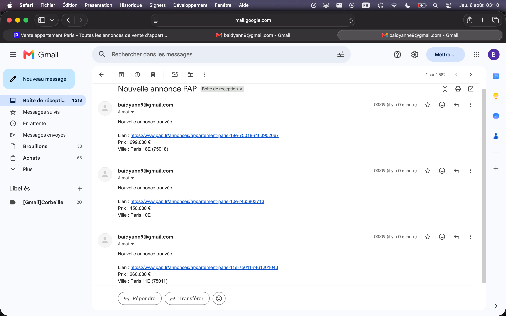

# Online Listing Monitor Bot

*[Lire en français](./README.md)*

## The problem

On any listings market — real estate, used vehicles, job postings, specialized equipment... — the best opportunities get taken within hours. Manually checking a site several times a day is time-consuming and unreliable: good opportunities inevitably get missed.

This bot automatically monitors new listings published on a given site matching a defined set of criteria (location, budget, keywords...) and sends an email notification as soon as a new matching listing goes live. No manual checking required.

**This implementation targets [PAP.fr](https://www.pap.fr) (real estate listings) as a concrete example**, but the underlying approach and architecture apply to any listings site: vehicles (Leboncoin, La Centrale), jobs (Indeed), professional equipment, and so on. Only the scraping module changes from one site to another — everything else (dedup, notifications, scheduling, logging) is directly reusable.

## Preview



*Screenshot: notification received for a newly detected listing.*

## Features

- Automatic scraping of the target site's search results (PAP.fr in this example)
- Criteria-based filtering handled directly via the site's search URL (no extra configuration needed in code, regardless of the site)
- Detects only genuinely new listings (deduplication based on each listing's unique ID)
- Instant email notification as soon as a new listing is detected
- Fully automated execution via cron, at a configurable interval
- Complete activity logging (successes, network errors, send failures)

## Tech stack

| Component | Choice | Why |
|---|---|---|
| Scraping | `requests` + `BeautifulSoup` | Simple, lightweight, sufficient for static HTML (no need for a headless browser) |
| Notification | `smtplib` (Gmail SMTP) | No external dependency, free, reliable |
| Deduplication | Text file + Python `set` | O(1) lookup, no database needed at this volume |
| Scheduling | `cron` | The bot only needs to run periodically — lighter and simpler to monitor than a long-running process |
| Logging | `logging` module (standard library) | Full traceability with no extra dependency |

## Architecture

```
monitoring_bot/
├── main.py           # Entry point: orchestrates scraping, dedup, and notifications
├── scrapper.py        # Fetches and parses PAP.fr listings
├── storage.py         # Tracks already-seen listing IDs
├── notifier.py         # Sends email notifications
├── setup_cron.py       # Automatic scheduled task installation
├── .env.example       # Configuration template
└── requirements.txt
```

## Setup

### 1. Clone the project and install dependencies

```bash
git clone <repo-url>
cd monitoring_bot
python3 -m venv venv
source venv/bin/activate
pip install -r requirements.txt
```

### 2. Configure environment variables

Copy `.env.example` to `.env` and fill in the values:

```bash
cp .env.example .env
```

| Variable | Description |
|---|---|
| `SEARCH_URL` | PAP.fr search URL with your criteria (location, budget...) already applied |
| `EMAIL_ADDRESS` | Gmail address used to send notifications |
| `EMAIL_APP_PASSWORD` | Gmail app password (see below) |
| `EMAIL_TO` | Recipient address for notifications |

To get `SEARCH_URL`: run a search on PAP.fr with your desired criteria, then copy the resulting URL from the address bar.

**To get `EMAIL_APP_PASSWORD`** (a regular Gmail password won't work):
1. Enable 2-Step Verification on the Google account you're using, if not already active: [myaccount.google.com/security](https://myaccount.google.com/security)
2. Go to [myaccount.google.com/apppasswords](https://myaccount.google.com/apppasswords)
3. Name the app (e.g. `Bot veille`) and click "Create"
4. Copy the generated password (16 characters) into `EMAIL_APP_PASSWORD` — it won't be shown again after this

### 3. Test it manually

```bash
python3 main.py
```

### 4. Automate execution

```bash
python3 setup_cron.py --interval 30
```

The `--interval` flag sets the frequency in minutes (30 by default). The script is idempotent: running it again updates the existing task instead of creating a duplicate.

### Removing the scheduled task

```bash
crontab -l | grep -v "# bot-veille-pap" | crontab -
```

## Logs

All bot activity is logged to `bot.log` (successes, scraping errors, email failures). Cron's standard output is redirected to `cron.log`.

## Current limitations and possible improvements

- Filtering is limited to criteria natively available on the target site; advanced code-side filtering (keywords, combined criteria...) can be added on request
- Single notification channel (email); other channels (Telegram, Slack, webhook...) can be integrated
- Single source site in this example; the architecture can be adapted to any other listings site (real estate, vehicles, jobs...) by only swapping out the scraping module

## License

Custom-built project — usage and adaptation available on request.